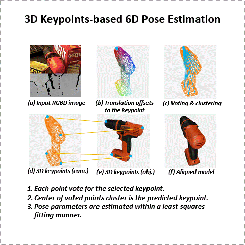
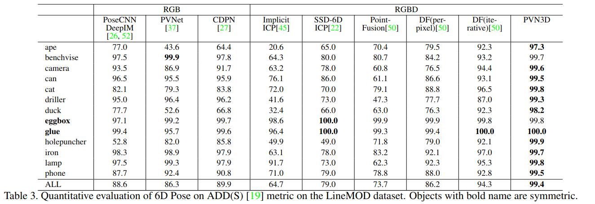
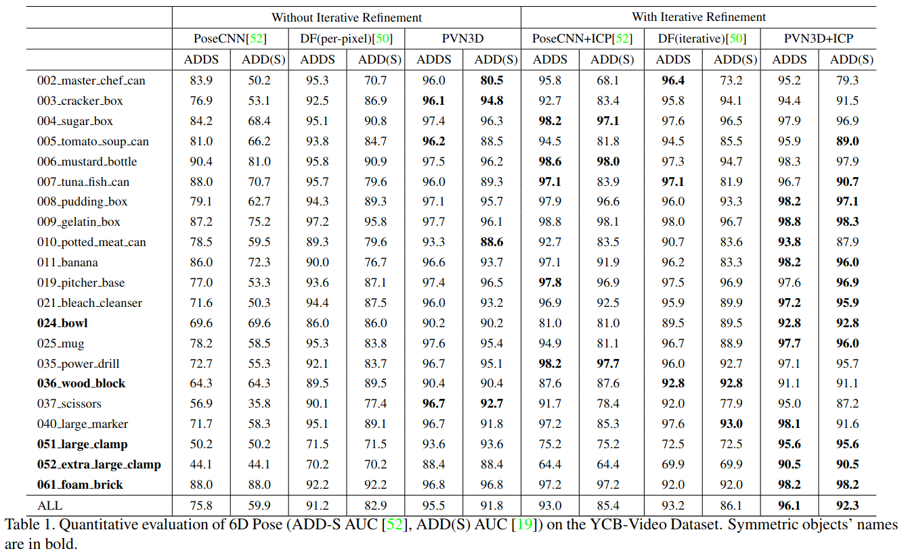
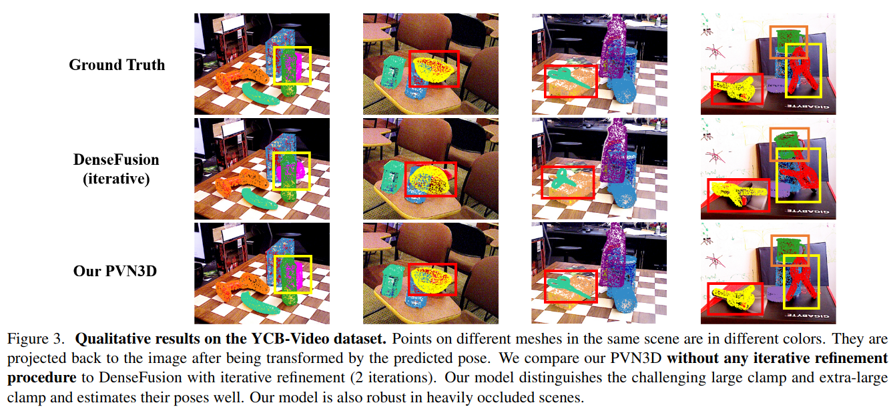
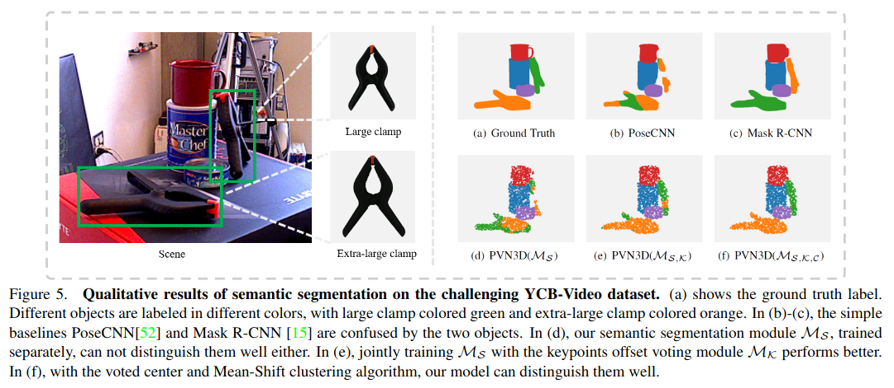

# PVN3D
This is the source code for ***PVN3D: A Deep Point-wise 3D Keypoints Voting Network for 6DoF Pose Estimation***, **CVPR 2020**. ([PDF](http://openaccess.thecvf.com/content_CVPR_2020/papers/He_PVN3D_A_Deep_Point-Wise_3D_Keypoints_Voting_Network_for_6DoF_CVPR_2020_paper.pdf), [Video_bilibili](https://www.bilibili.com/video/av89408773/), [Video_youtube](https://www.youtube.com/watch?v=ZKo788cyD-Q&t=1s)).

<div align=center></div>

## Installation
- The following setting is for pytorch 1.0.1. For pytorch 1.5 & cuda 10, switch to branch [pytorch-1.5](https://github.com/ethnhe/PVN3D/tree/pytorch-1.5).
- Install CUDA9.0
- Set up python environment from requirement.txt:
  ```shell
  pip3 install -r requirement.txt 
  ```
- Install tkinter through ``sudo apt install python3-tk``
- Install [python-pcl](https://github.com/strawlab/python-pcl).
- Install PointNet++ (refer from [Pointnet2_PyTorch](https://github.com/erikwijmans/Pointnet2_PyTorch)):
  ```shell
  python3 setup.py build_ext
  ```

## Datasets
- **LineMOD:** Download the preprocessed LineMOD dataset from [here](https://drive.google.com/drive/folders/19ivHpaKm9dOrr12fzC8IDFczWRPFxho7) (refer from [DenseFusion](https://github.com/j96w/DenseFusion)). Unzip it and link the unzipped ``Linemod_preprocessed/`` to ``pvn3d/datasets/linemod/Linemod_preprocessed``:
  ```shell
  ln -s path_to_unzipped_Linemod_preprocessed pvn3d/dataset/linemod/
  ```
- **YCB-Video:** Download the YCB-Video Dataset from [PoseCNN](https://rse-lab.cs.washington.edu/projects/posecnn/). Unzip it and link the unzipped```YCB_Video_Dataset``` to ```pvn3d/datasets/ycb/YCB_Video_Dataset```:

  ```shell
  ln -s path_to_unzipped_YCB_Video_Dataset pvn3d/datasets/ycb/
  ```


## Training and evaluating

### Training on the LineMOD Dataset
- First, generate synthesis data for each object using scripts from [raster triangle](https://github.com/ethnhe/raster_triangle).
- Train the model for the target object. Take object ape for example:
  ```shell
  cd pvn3d
  python3 -m train.train_linemod_pvn3d --cls ape
  ```
  The trained checkpoints are stored in ``train_log/linemod/checkpoints/{cls}/``, ``train_log/linemod/checkpoints/ape/`` in this example.

### Evaluating on the LineMOD Dataset
- Start evaluation by:
  ```shell
  # commands in eval_linemod.sh
  cls='ape'
  tst_mdl=train_log/linemod/checkpoints/${cls}/${cls}_pvn3d_best.pth.tar
  python3 -m train.train_linemod_pvn3d -checkpoint $tst_mdl -eval_net --test --cls $cls
  ```
  You can evaluate different checkpoint by revising ``tst_mdl`` to the path of your target model.
- We provide our pre-trained models for each object at [onedrive link](https://hkustconnect-my.sharepoint.com/:f:/g/personal/yhebk_connect_ust_hk/Ehay5pPtl-BGnvAEclXBRu8BEpZeHuG9x-aN_djAtt5rPA?e=3BvfrV), [baiduyun link](https://pan.baidu.com/s/1MhqPvjROCkR17W1tiXE9SA) (access code(提取码): 8kmp). Download them and move them to their according folders. For example, move the ``ape_pvn3d_best.pth.tar`` to ``train_log/linemod/checkpoints/ape/``. Then revise ``tst_mdl=train_log/linemod/checkpoints/ape/ape_pvn3d_best.path.tar`` for testing.

### Demo/visualizaion on the LineMOD Dataset
- After training your models or downloading the pre-trained models, you can start the demo by:
  ```shell
  # commands in demo_linemod.sh
  cls='ape'
  tst_mdl=train_log/linemod/checkpoints/${cls}/${cls}_pvn3d_best.pth.tar
  python3 -m demo -dataset linemod -checkpoint $tst_mdl -cls $cls
  ```
  The visualization results will be stored in ``train_log/linemod/eval_results/{cls}/pose_vis``

### Training on the YCB-Video Dataset
- Preprocess the validation set to speed up training:
  ```shell
  cd pvn3d
  python3 -m datasets.ycb.preprocess_testset
  ```
- Start training on the YCB-Video Dataset by:
  ```shell
  python3 -m train.train_ycb_pvn3d
  ```
  The trained model checkpoints are stored in ``train_log/ycb/checkpoints/``

### Evaluating on the YCB-Video Dataset
- Start evaluating by:
  ```shell
  # commands in eval_ycb.sh
  tst_mdl=train_log/ycb/checkpoints/pvn3d_best.pth.tar
  python3 -m train.train_ycb_pvn3d -checkpoint $tst_mdl -eval_net --test
  ```
  You can evaluate different checkpoint by revising the ``tst_mdl`` to the path of your target model.
- We provide our pre-trained models at [onedrive link](https://hkustconnect-my.sharepoint.com/:f:/g/personal/yhebk_connect_ust_hk/EmQQXKJdC1FDplKS4FQ6n78B4T7eyvhSEsZ8dZySJUmv4w?e=7BwsS5), [baiduyun link](https://pan.baidu.com/s/1hCzqfB3JhOzF3LATsWFFBg) (access code(提取码): h2i5). Download the ycb pre-trained model, move it to ``train_log/ycb/checkpoints/`` and modify ``tst_mdl`` for testing.

### Demo/visualizaion on the LineMOD Dataset
- After training your model or downloading the pre-trained model, you can start the demo by:
  ```shell
  # commands in demo_ycb.sh
  tst_mdl=train_log/ycb/checkpoints/pvn3d_best.pth.tar
  python3 -m demo -checkpoint $tst_mdl -dataset ycb
  ```
  The visualization results will be stored in ``train_log/ycb/eval_results/pose_vis``

## Results
- Evaluation result on the LineMOD dataset:
  
- Evaluation result on the YCB-Video dataset:
  
- Visualization of some predicted poses on YCB-Video dataset:
  
- Joint training for distinguishing objects with similar appearance but different in size:
  

## Citations
Please cite [PVN3D](https://arxiv.org/abs/1911.04231) if you use this repository in your publications:
```
@InProceedings{He_2020_CVPR,
author = {He, Yisheng and Sun, Wei and Huang, Haibin and Liu, Jianran and Fan, Haoqiang and Sun, Jian},
title = {PVN3D: A Deep Point-Wise 3D Keypoints Voting Network for 6DoF Pose Estimation},
booktitle = {IEEE/CVF Conference on Computer Vision and Pattern Recognition (CVPR)},
month = {June},
year = {2020}
}
```
